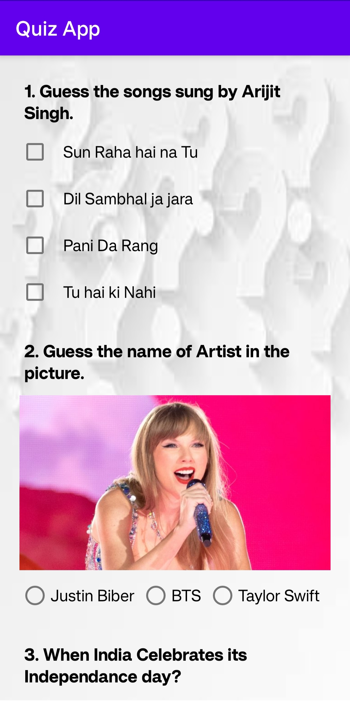
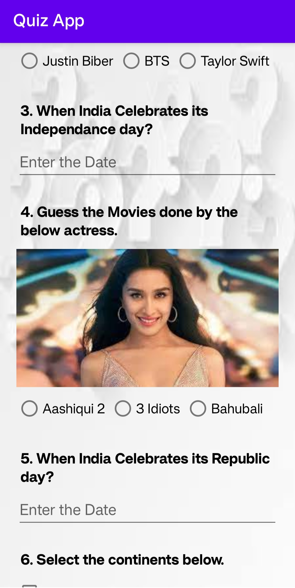
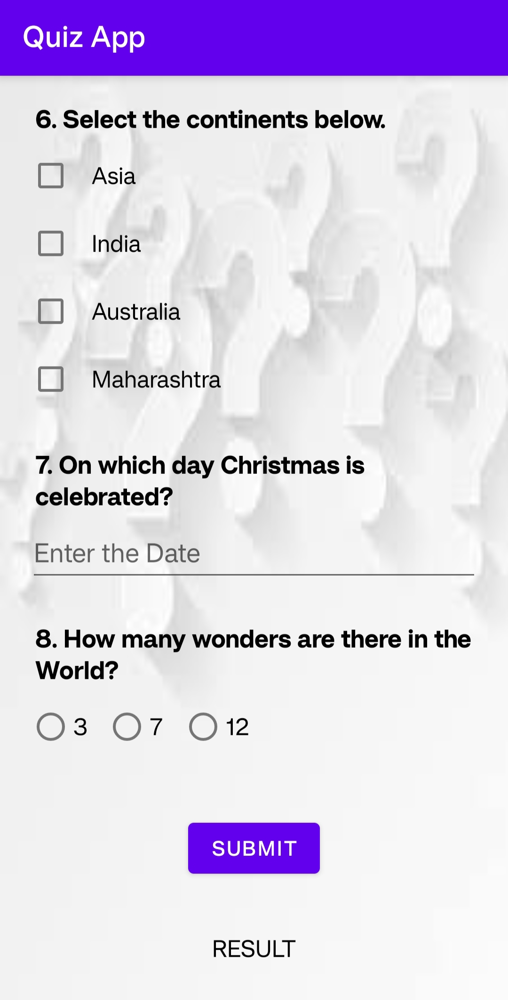
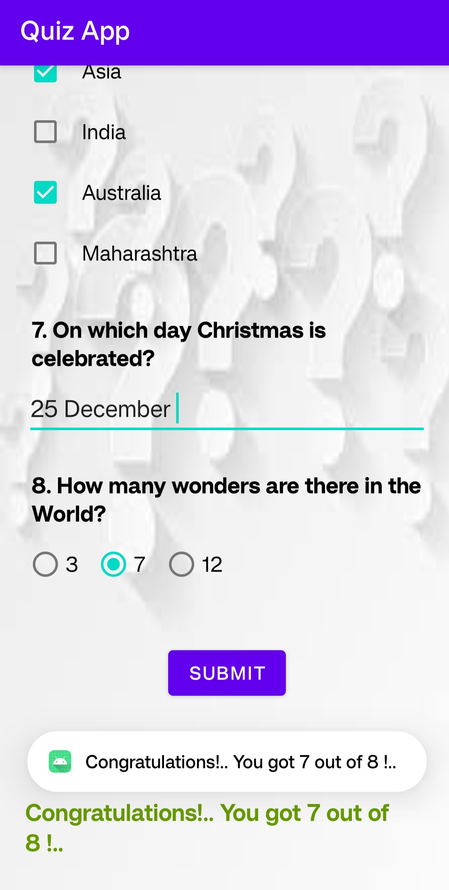
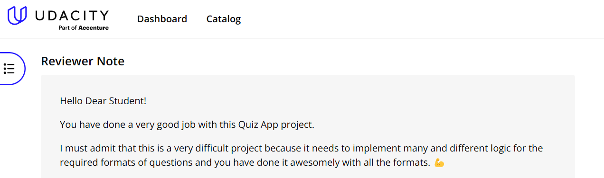
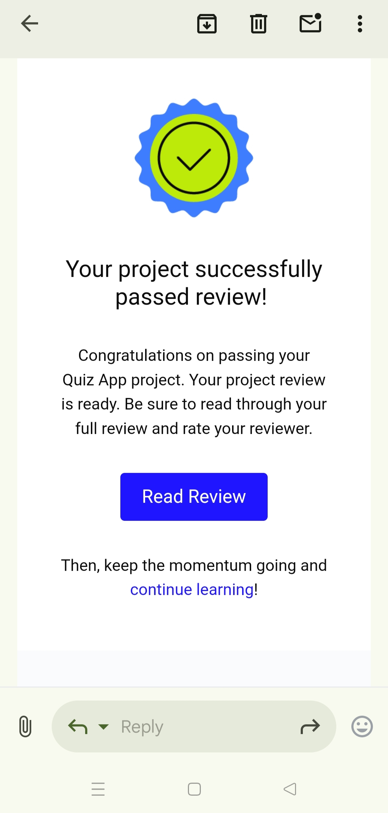

# 📌 Quiz App  

This app was developed as part of the **Android Basics: User Input** course, a module in the **Udacity Android Basics Nanodegree** program.

## 📌 Project Overview  
The goal was to create an **educational app** that quizzes a user about a certain topic of choice.

## ✅ Requirements Followed  
The app includes the following:  
- **Planning the app design before coding.**  
- **Taking an app layout from drawing to XML code.**  
- **App includes a button for submitting answers and receiving a score.**  
- **Creating, positioning, and styling views.**  
- **App contains 4 - 10 questions, including:**  
  - At least **one checkbox**  
  - At least **one radio button**  
  - At least **one text entry**  
- **Radio button questions allow only one selection at a time.**  
- **Grading button displays a toast message with quiz results.**  
- **Grading logic correctly checks each answer.**  
- **App accurately calculates the number of correct answers without counting incorrect ones.**  
- **Interactivity through button clicks and Java code.**  
- **Commenting and documenting the code.**  

---

## 📱 Screens of the App  
The **Quiz App** is an engaging application that tests general knowledge with a variety of questions:  
✔ **Radio buttons** for single-choice questions, allowing only one selection.  
✔ **Checkboxes** for multiple-choice questions.  
✔ **Text input fields**, which are case-insensitive.  
✔ **Beautiful and visually appealing UI design**, fully responsive across different screen sizes.  

Upon clicking the **"Submit"** button:  
✔ The result is displayed in text format.  
✔ A **toast message** appears to notify the user of their score.  

### 🖼️ **Screenshots**  

 &nbsp;&nbsp;&nbsp;&nbsp;&nbsp;&nbsp;&nbsp;&nbsp;   &nbsp;&nbsp;&nbsp;&nbsp;&nbsp;&nbsp;&nbsp;&nbsp;  &nbsp;&nbsp;&nbsp;&nbsp;&nbsp;&nbsp;&nbsp;&nbsp;  

---

## ⭐ Review from Udacity  

 
 

---
